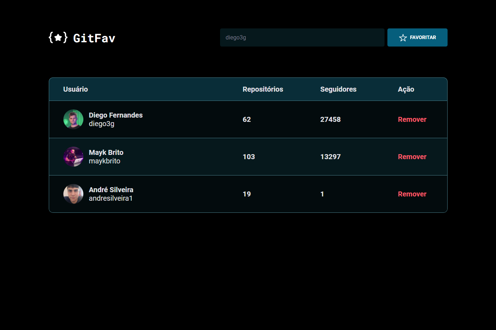

<h1 align="center">Github Favorites</h1>

  <a href="#-technologies">Technologies</a>
  &nbsp;&nbsp;&nbsp;|&nbsp;&nbsp;&nbsp;
  <a href="#-functions">Functions</a>&nbsp;&nbsp;&nbsp;|&nbsp;&nbsp;&nbsp;
  <a href="#-project">Project</a>

 

 

## 🚀 Technologies

This project has been developed with the following technologies:

- HTML
- CSS
- JavaScript
- ES6(module)

## 🛠️ Functions

- Class.
- Class with extends.
- Static Class.
- Async, await, try, catch..
- Github API.
- LocalStorage to save and load a data.
- Manipulation of HTML with JavaScript.
- Create a HTML tag with JavaScript

## 💻 Project

The Github Favorites is a project of Explorer course from Rocketseat. A application that search a user from github and add to a favorive table.
